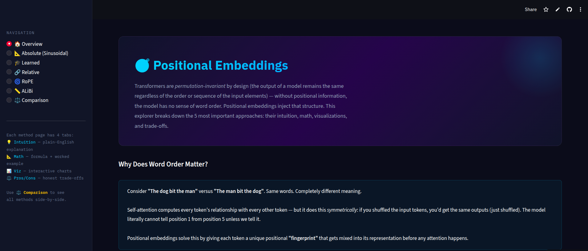
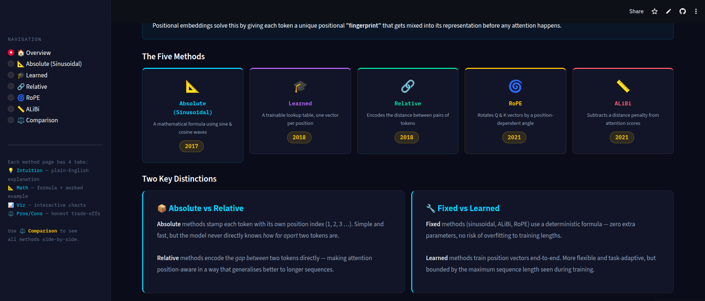

# 🧭 Positional Embedding Explorer

Interactive dashboard to visualize and compare **Positional Embedding** techniques like Absolute Positional Encoding, RoPE, ALiBi, etc. Adjust inputs and parameters in real-time, see outputs, formulas, pros/cons, and use cases.

Made for personal use to keep info centralized, and happy to share it!

## Link
[Go To The App](https://positional-embedding-wddrbmnuxb2yyxeqd7mikh.streamlit.app/)




## Usage


```bash
pip install -r requirements.txt
streamlit run app.py